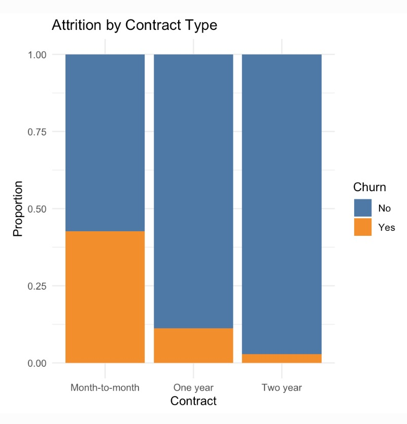
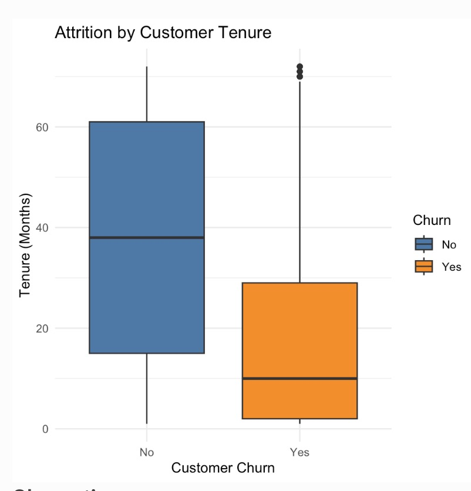
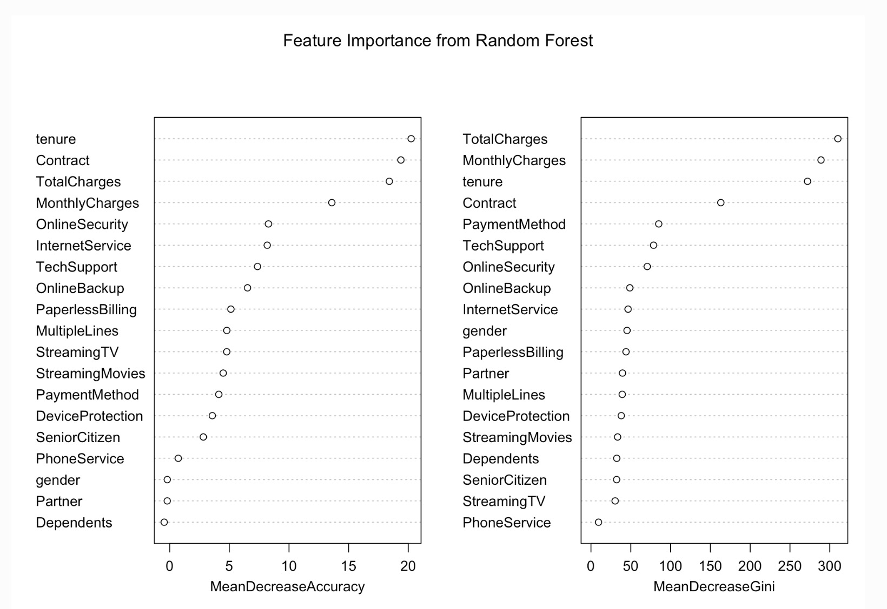

<h1 align="center">Telco Customer Retention Analysis</h1>

<p align="center">
  
</p>

An end-to-end data analysis project that performs a comprehensive exploratory data analysis (EDA) and builds predictive models to understand the key drivers of customer attrition in the telecommunications industry. This project uses R, `tidyverse`, and `caret` to deliver actionable business insights from raw data, achieving approximately 81% prediction accuracy.

---

## 🚀 Table of Contents

- [✨ Project Overview](#-project-overview)
- [📊 Dataset](#-dataset)
- [🛠️ Technologies & Libraries](#️-technologies--libraries)
- [🔬 Methodology](#-methodology)
- [📈 Key Findings & Visualizations](#-key-findings--visualizations)
- [📂 Project Structure](#-project-structure)
- [▶️ How to Run](#️-how-to-run)
- [📄 License](#-license)
- [📜 Citation](#-citation)

---

## ✨ Project Overview

This project provides a complete workflow for a real-world business problem: customer churn. The primary goal is to move from raw data to actionable insights by cleaning the data, exploring it to find patterns, and building predictive models to identify at-risk customers.

### Key Highlights:
- **Comprehensive EDA**: In-depth analysis of customer demographics, account information, and service usage to identify key trends related to churn.
- **Predictive Modeling**: Implementation and evaluation of Logistic Regression and Random Forest models to predict customer attrition.
- **Data-Driven Insights**: The analysis successfully identifies critical factors like contract type and customer tenure as the most significant predictors of churn.
- **Professional Reporting**: The entire analysis is documented in a self-contained R Markdown file, which generates both professional PDF and interactive HTML reports.

---

## 📊 Dataset

This analysis utilizes the **Telco Customer Churn** dataset, a popular and realistic dataset for classification tasks.

- **Source**: Kaggle
- **Content**: Contains 7,043 customer records with 21 attributes, including demographic information, account details, services subscribed to, and the target variable, `Churn`.
- **File**: `WA_Fn-UseC_-Telco-Customer-Churn.csv`

---

## 🛠️ Technologies & Libraries

This project is built entirely in the **R** ecosystem, leveraging the following core libraries for data manipulation, visualization, and modeling:

- **`tidyverse`**: A collection of R packages for data science, including `ggplot2` (for plotting) and `dplyr` (for data manipulation).
- **`caret`**: A comprehensive framework for building and evaluating predictive models.
- **`randomForest`**: For implementing the Random Forest algorithm.
- **`knitr` & `rmarkdown`**: For creating dynamic and professional reports.
- **`kableExtra`**: For generating well-formatted, publication-quality tables.
- **`corrplot`**: For visualizing correlation matrices.
- **`gridExtra`**: For arranging multiple plots on a single grid.

---

## 🔬 Methodology

The project follows a standard data science workflow:

1.  **Data Cleaning & Preprocessing**:
    - Loaded the raw `.csv` data.
    - Inspected data types and identified inconsistencies (e.g., `TotalCharges` as character, `SeniorCitizen` as numeric).
    - Handled missing values and converted columns to their appropriate data types to prepare the data for analysis.

2.  **Exploratory Data Analysis (EDA)**:
    - Analyzed the distribution of the target variable (`Churn`) to understand the class imbalance.
    - Visualized the relationship between churn and key demographic features (gender, senior citizen status, partners, dependents).
    - Investigated how account information, particularly `Contract` type and `tenure`, impacts customer retention.
    - Explored the correlation between key numeric features (`tenure`, `MonthlyCharges`, `TotalCharges`).

3.  **Predictive Modeling**:
    - Split the data into a 70% training set and a 30% testing set.
    - Built a **Logistic Regression** model as an interpretable baseline.
    - Built a **Random Forest** model to leverage its predictive power and generate feature importance rankings.
    - Evaluated both models on the unseen test data using accuracy and confusion matrices.

---

## 📈 Key Findings & Visualizations

The analysis uncovered several actionable insights, which were consistently supported by both the EDA and the predictive models.

#### 1. Contract Type is the Most Critical Factor
Customers with **Month-to-Month** contracts have a dramatically higher churn rate than those with one or two-year contracts.

<p align="center">
  
</p>

#### 2. Customer Tenure is a Strong Predictor
Newer customers (low tenure) are at a much higher risk of churning. Loyalty increases significantly as tenure grows.

<p align="center">
  
</p>

#### 3. Feature Importance Confirms EDA
The Random Forest model's feature importance plot confirmed that `Contract`, `tenure`, and `TotalCharges` are the most influential variables in predicting churn.

<p align="center">
  
</p>

---

## 📂 Project Structure

```
├── Telco_Customer_Retention_Analysis.Rmd   # Main R Markdown file with all code and analysis
├── Telco_Customer_Retention_Analysis.html  # Rendered professional HTML report
├── Telco_Customer_Retention_Analysis.pdf   # Rendered professional PDF report
├── WA_Fn-UseC_-Telco-Customer-Churn.csv    # The raw dataset
├── README.md                               # This README file
└── requirements.txt                        # List of required R packages
```

---

## ▶️ How to Run

To reproduce this analysis, follow these steps:

1.  **Clone the repository:**
    ```bash
    git clone [https://github.com/X-XENDROME-X/Telco-Customer-Retention-Analysis.git](https://github.com/X-XENDROME-X/Telco-Customer-Retention-Analysis.git)
    cd Telco-Customer-Retention-Analysis
    ```

2.  **Prerequisites:**
    - Ensure you have **R** and **RStudio** installed on your system.
    - Open the R console and install the required packages by running the following command:
      ```R
      install.packages(c("tidyverse", "knitr", "rmdformats", "caret", "randomForest", "gridExtra", "corrplot", "kableExtra"))
      ```

3.  **Run the Analysis:**
    - Open the `Telco_Customer_Retention_Analysis.Rmd` file in RStudio.
    - Click the **"Knit"** button to generate the HTML report.
    - To generate the PDF report, click the dropdown arrow next to "Knit" and select **"Knit to PDF"**. (Note: A LaTeX distribution like MiKTeX, MacTeX, or TinyTeX is required for PDF rendering).

---

## 📄 License

This project is licensed under the **MIT License**. See the [LICENSE](LICENSE) file for details.

---

## 📜 Citation

The dataset used in this analysis is publicly available on Kaggle and was provided by BlastChar.

- **Dataset:** Telco Customer Churn
- **Source:** [https://www.kaggle.com/datasets/blastchar/telco-customer-churn](https://www.kaggle.com/datasets/blastchar/telco-customer-churn)
